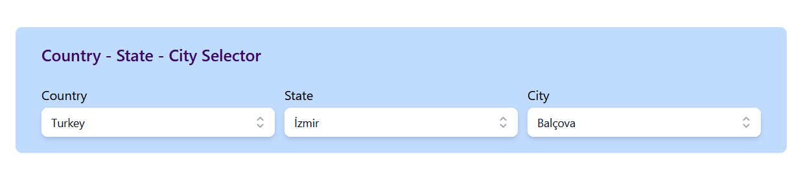

# Country-State-City Selector

## Description

This project is a simple React application that allows users to select a country, state, and city. The application is styled using Tailwind CSS to provide a modern and sleek user interface. The main goal of the project is to create a location selector component and develop a dynamic user interface using React's component structure and Tailwind's styling features.

## Usage

The application provides an interface where users can select a country, state, and city. The selections are updated dynamically, and each selection filters the options for the next selection.

## Technologies Used

- **React**: A JavaScript library for building user interfaces.
- **Tailwind CSS**: A utility-first CSS framework for rapid UI development.
- **@headlessui/react**: Completely unstyled, fully accessible UI components.
- **@heroicons/react**: A set of free MIT-licensed high-quality SVG icons for you to use in your web projects.
- **country-state-city**: A library that provides country, state, and city data for your applications.
